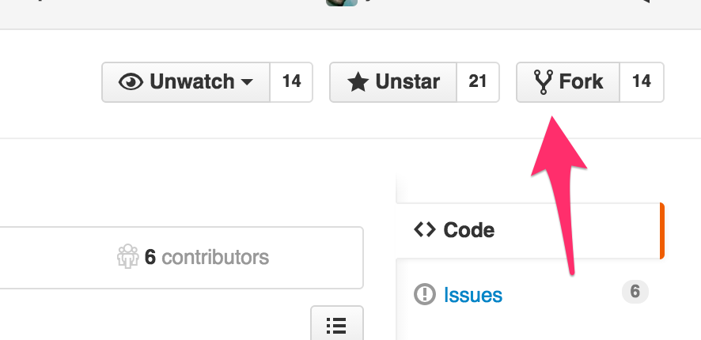
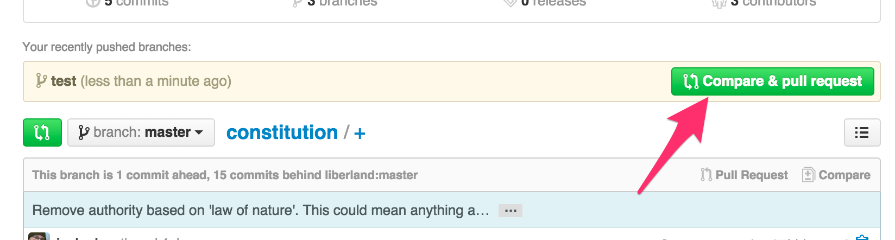

# How to set it up

If you're new to GitHub, setting up git and working with GitHub can be challenging and even frustrating. Try to follow the instructions below, exactly as written. We've tried to make it as simple as we can.

## Set up your Git environment

1. [Set up git](https://help.github.com/articles/set-up-git/).

2. Fork this repository.

  

3. Clone the repository:

  ```
  git clone git@github.com:my-github-username/constitution.git
  cd constitution
  git remote add upstream https://github.com/liberland/constitution.git
  git fetch upstream
  git checkout -b up upstream/master
  ```
  
## Do a pull request

1. Create a new branch:

  ```
  git checkout up
  git pull
  git checkout -b my-new-branch
  ```
  
2. Open the file in your editor and make your change.

3. Push your change:

  ```
  git add .
  git commit -m "My change description"
  git push
  ```
  
4. Create the pull request by going to your own cloned repository and pressing:

  

